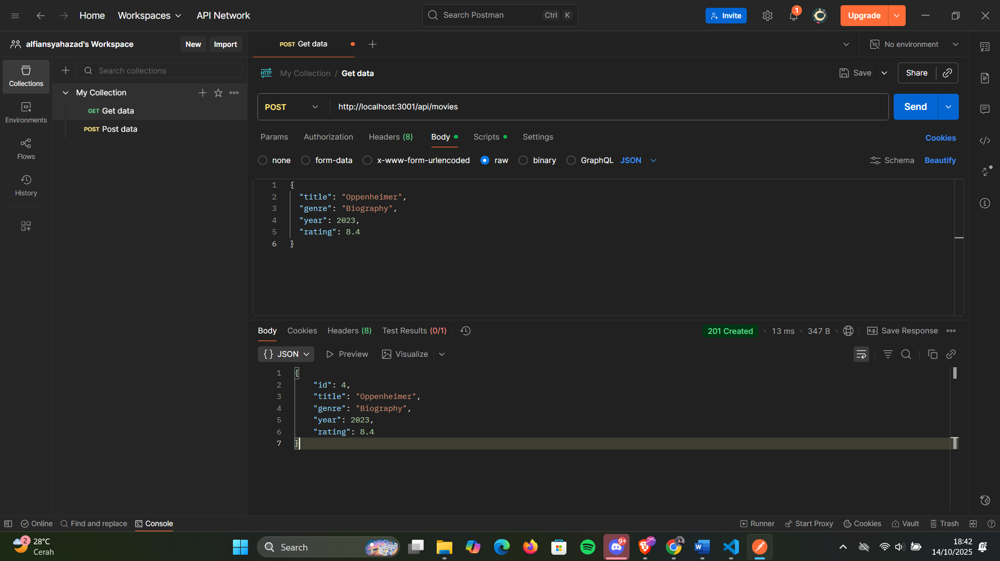

## 1. GET /api/books

## 2. GET /api/books/:id

## 3. POST /api/books

## 4. PUT /api/books/:id

## 5. DELETE /api/books/:id

## 1. GET /api/movies

## 2. GET /api/movies/:id

## 3. POST /api/MOVIES

## 4. PUT /api/MOVIES/:id

## 5. DELETE /api/MOVIES/:id

